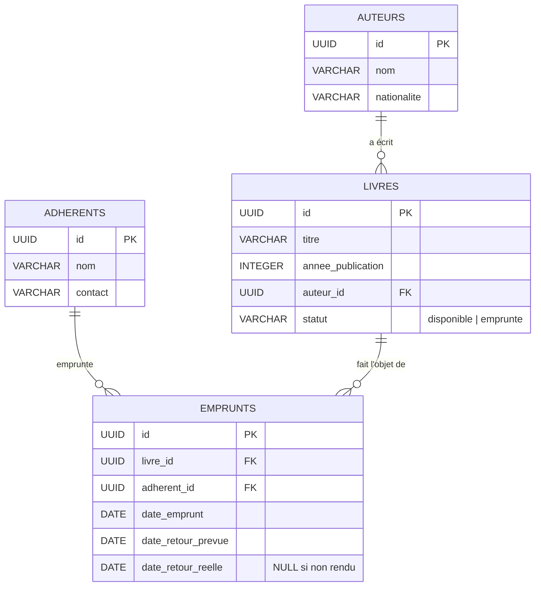

# Diagramme entité-relation — Bibliothèque de quartier

Ce diagramme reflète exactement les tables, colonnes, clés et relations définies dans [`schema.sql`](./schema.sql). Il s'affiche automatiquement sur GitHub (format Mermaid).

## Cardinalités

- **1 auteur → N livres** : un auteur peut avoir écrit plusieurs livres ; un livre a un seul auteur (`livres.auteur_id`, `NOT NULL`, `ON DELETE RESTRICT`).
- **1 adhérent → N emprunts** : un adhérent peut avoir plusieurs emprunts (en cours et passés) (`emprunts.adherent_id`, `NOT NULL`, `ON DELETE RESTRICT`).
- **1 livre → N emprunts** : un livre peut être emprunté plusieurs fois dans le temps, mais un seul emprunt en cours à la fois — garanti par la logique métier (`livres.statut`) plutôt que par une contrainte SQL directe (`emprunts.livre_id`, `NOT NULL`, `ON DELETE RESTRICT`).

## Notes de modélisation

- Toutes les clés primaires sont des **UUID** générés par PostgreSQL (`gen_random_uuid()`, extension `pgcrypto`).
- `livres.statut` est une colonne dénormalisée (plutôt que calculée) : elle est mise à jour de façon transactionnelle à chaque création/retour d'emprunt, avec une contrainte `CHECK` limitant ses valeurs à `disponible` / `emprunte`.
- Le retard d'un emprunt n'est **pas** une colonne : il est déduit à la volée (`date_retour_prevue < CURRENT_DATE AND date_retour_reelle IS NULL`).
- Des contraintes `CHECK` garantissent la cohérence des dates (`date_retour_prevue >= date_emprunt`, `date_retour_reelle >= date_emprunt`).
- Des index (`idx_livres_auteur_id`, `idx_emprunts_livre_id`, `idx_emprunts_adherent_id`, `idx_livres_titre`, et un index partiel `idx_emprunts_en_cours`) accélèrent les jointures et les recherches les plus fréquentes de l'application.
